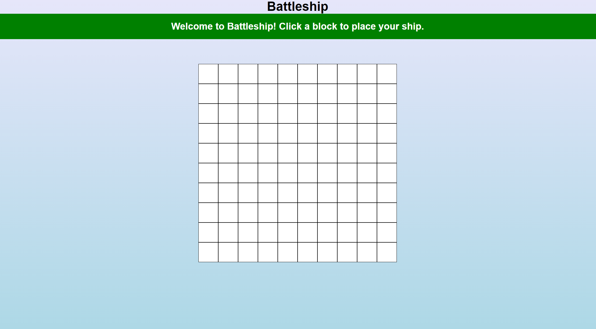

# Battleship Game

This is an implementation of the classic Battleship game. It's built with JavaScript, HTML, and CSS.

## Overview

In this game, you play against the computer. Each player has a fleet of ships and the objective of the game is to destroy the opponent's fleet.

## Features

- Player vs Computer gameplay
- Smart AI for the computer: Once the computer hits a ship, it continues to attack adjacent cells until the ship is sunk.
- Visual and text feedback for hits, misses, and sunk ships
- Game over condition when all of a player's or computer's ships are sunk

## How to Play

1. Place all 5 of your ships on your board. 
2. Click on a cell in the computer's grid to attack that cell.
3. The result of your attack will be displayed - a hit, a miss, or a sunk ship.
4. After your turn, the computer will take its turn. The result of the computer's attack will be displayed.
5. The game continues until all the ships of a player are sunk. The player who still has ships left is the winner.

## Installation

1. Clone this repository: `git clone https://github.com/arthurseverino/battleship.git`
2. Navigate to the project directory: `cd battleship`
3. Install the project dependencies: `npm install`
4. Start the development server: `npm run start`
5. Open your browser and go to `http://localhost:8080`

## Testing

This project uses Jest for testing. To run the tests, use the following command: `npm run test`

## Future Improvements

- Add difficulty levels for the computer player
- Add multiplayer support
- Add support for vertical ship placement 

## Contributing

Pull requests are welcome. For major changes, please open an issue first to discuss what you would like to change.

